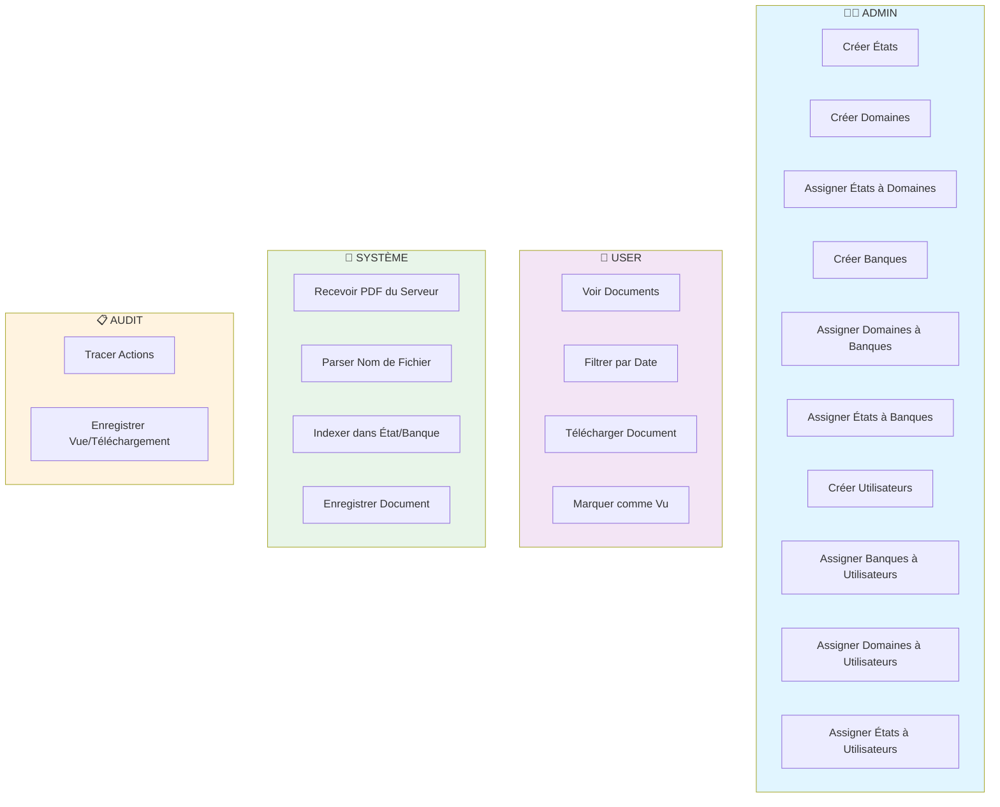
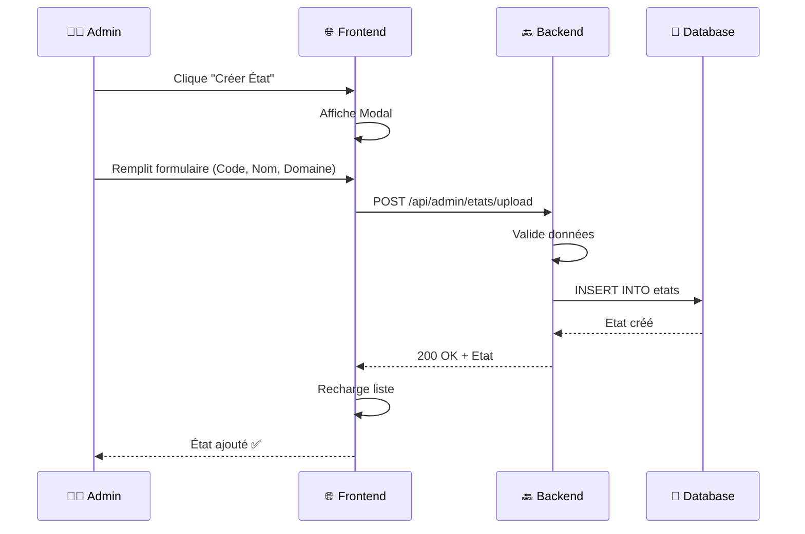
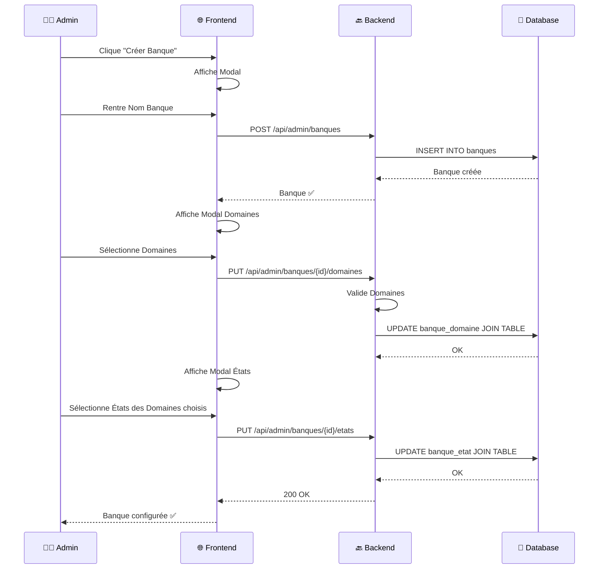
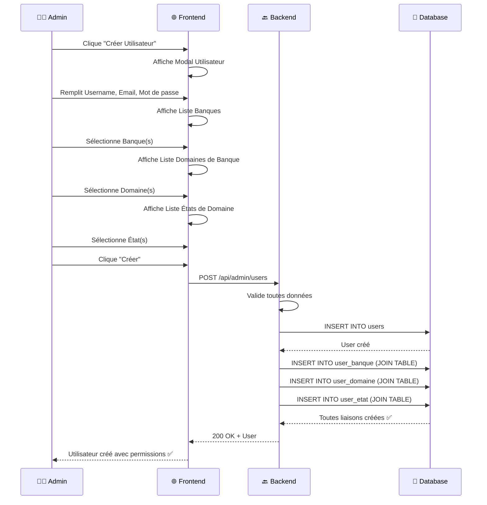
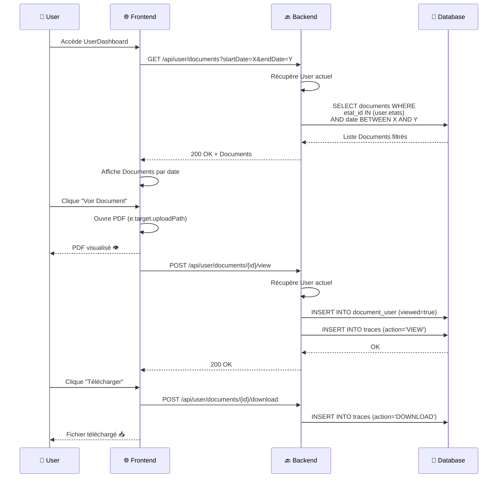
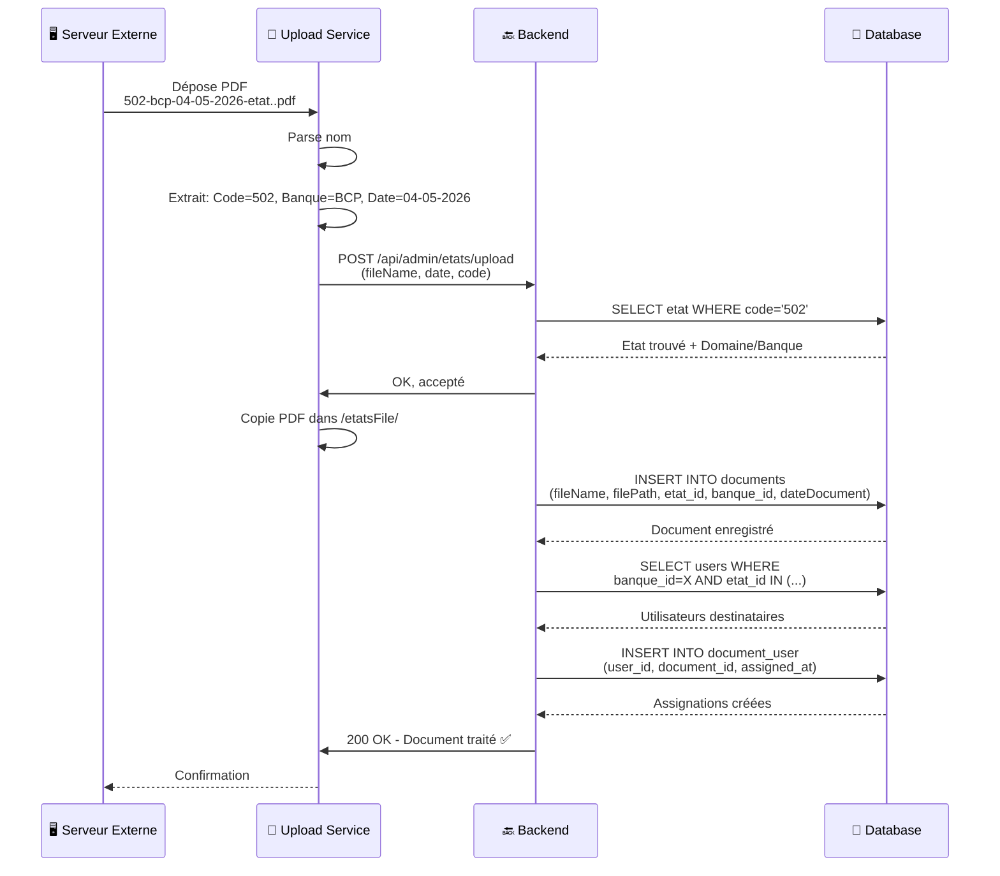

# 📊 Diagrammes UML - Système de Gestion d'États Réglementaires

## 1️⃣ Diagramme de Classe

```mermaid
classDiagram

    class User {
        - id: Long
        - username: String
        - fullName: String
        - email: String
        - password: String
        - role: Role (ADMIN/USER)
        - status: Status (ACTIVE/INACTIVE)
        - createdAt: LocalDateTime
        + getId(): Long
        + getUsername(): String
        + getFullName(): String
        + getEmail(): String
        + getPassword(): String
        + getRole(): Role
        + getStatus(): Status
        + getCreatedAt(): LocalDateTime
        + getBanques(): Set~Banque~
        + getDomaines(): Set~Domaine~
        + getEtats(): Set~Etat~
        + setPassword(pw: String): void
        + addBanque(b: Banque): void
        + removeBanque(b: Banque): void
        + addDomaine(d: Domaine): void
        + removeDomaine(d: Domaine): void
        + addEtat(e: Etat): void
        + removeEtat(e: Etat): void
    }

    class Banque {
        - id: Long
        - name: String
        + getId(): Long
        + getName(): String
        + setName(n: String): void
        + getDomaines(): Set~Domaine~
        + addDomaine(d: Domaine): void
        + removeDomaine(d: Domaine): void
        + getEtats(): Set~Etat~
        + addEtat(e: Etat): void
        + removeEtat(e: Etat): void
        + getUsers(): Set~User~
        + addUser(u: User): void
        + removeUser(u: User): void
    }

    class Domaine {
        - id: Long
        - name: String
        + getId(): Long
        + getName(): String
        + setName(n: String): void
        + getBanques(): Set~Banque~
        + addBanque(b: Banque): void
        + removeBanque(b: Banque): void
        + getEtats(): Set~Etat~
        + addEtat(e: Etat): void
        + removeEtat(e: Etat): void
        + getUsers(): Set~User~
        + addUser(u: User): void
        + removeUser(u: User): void
    }

    class Etat {
        - id: Long
        - code: String (unique)
        - nom: String
        - description: String
        - frequence: String (HOURLY/DAILY/WEEKLY/MONTHLY/YEARLY)
        - uploadPath: String
        + getId(): Long
        + getCode(): String
        + getNom(): String
        + getDescription(): String
        + getFrequence(): String
        + getUploadPath(): String
        + getDomaine(): Domaine
        + setDomaine(d: Domaine): void
        + getUsers(): Set~User~
        + addUser(u: User): void
        + removeUser(u: User): void
    }

    class Document {
        - id: Long
        - fileName: String
        - filePath: String
        - dateDocument: LocalDate
        - uploadedAt: LocalDateTime
        + getId(): Long
        + getFileName(): String
        + setFileName(n: String): void
        + getFilePath(): String
        + setFilePath(p: String): void
        + getDateDocument(): LocalDate
        + setDateDocument(d: LocalDate): void
        + getUploadedAt(): LocalDateTime
        + setUploadedAt(dt: LocalDateTime): void
        + getEtat(): Etat
        + setEtat(e: Etat): void
    }

    class DocumentUser {
        - id: Long
        - viewed: Boolean
        - viewedAt: LocalDateTime
        - assignedAt: LocalDateTime
        + getId(): Long
        + isViewed(): Boolean
        + setViewed(v: Boolean): void
        + getViewedAt(): LocalDateTime
        + setViewedAt(dt: LocalDateTime): void
        + getAssignedAt(): LocalDateTime
        + setAssignedAt(dt: LocalDateTime): void
        + getUser(): User
        + setUser(u: User): void
        + getDocument(): Document
        + setDocument(d: Document): void
    }

    class Trace {
        - id: Long
        - action: String (VIEW, DOWNLOAD)
        - actionDate: LocalDateTime
        + getId(): Long
        + getAction(): String
        + setAction(a: String): void
        + getActionDate(): LocalDateTime
        + setActionDate(dt: LocalDateTime): void
        + getUser(): User
        + setUser(u: User): void
        + getDocument(): Document
        + setDocument(d: Document): void
    }

    User "*" -- "*" Banque : banques
    User "*" -- "*" Domaine : domaines
    User "*" -- "*" Etat : etats
    Banque "*" -- "*" Domaine : domaines
    Banque "*" -- "*" Etat : etats
    Domaine "1" -- "*" Etat : etats
    Document "*" -- "1" Etat : etat
    DocumentUser "*" -- "1" User : user
    DocumentUser "*" -- "1" Document : document
    Trace "*" -- "1" User : user
    Trace "*" -- "1" Document : document
```



---

## 2️⃣ Diagramme des Use Cases



---

## 3️⃣ Diagramme de Séquence - Création d'État



---

## 4️⃣ Diagramme de Séquence - Affectation Banque → Domaines → États



---

## 5️⃣ Diagramme de Séquence - Création Utilisateur avec Permissions



---

## 6️⃣ Diagramme de Séquence - User View Documents (Filtré par Date)



---

## 7️⃣ Diagramme de Séquence - Réception PDF du Serveur Externe



---

## 8️⃣ Flux Global (Swimlanes)

```mermaid
graph LR
    A["📋 Admin<br/>Configure"] -->|1. Crée États| B["🔴 Etats"]
    B -->|2. Groupe en| C["🟡 Domaines"]
    C -->|3. Assigne à| D["🟢 Banques"]
    D -->|4. Crée Users| E["👤 Utilisateurs"]
    E -->|5. Reçoit PDFs| F["📄 Documents"]
    F -->|6. Consulte par date| G["👁️ Visualise"]
    G -->|7. Trace actions| H["📊 Audit Logs"]

    style A fill:#e1f5ff
    style B fill:#ffe0b2
    style C fill:#fff9c4
    style D fill:#c8e6c9
    style E fill:#f3e5f5
    style F fill:#ffccbc
    style G fill:#b3e5fc
    style H fill:#fff3e0
```



---

## 9️⃣ Matrice d'Accès (RBAC)

| Fonction | Admin | User | Système |
|----------|-------|------|---------|
| Créer État | ✅ | ❌ | ❌ |
| Créer Domaine | ✅ | ❌ | ❌ |
| Créer Banque | ✅ | ❌ | ❌ |
| Assigner État→Domaine | ✅ | ❌ | ❌ |
| Assigner Domaine→Banque | ✅ | ❌ | ❌ |
| Créer Utilisateur | ✅ | ❌ | ❌ |
| Voir Documents (filtrés) | ❌ | ✅ | ❌ |
| Filtrer par Date | ❌ | ✅ | ❌ |
| Télécharger Documents | ❌ | ✅ | ❌ |
| Upload PDFs | ❌ | ❌ | ✅ |
| Voir Audit Logs | ✅ | ❌ | ❌ |

---

## 🔟 Technologies Stack

```
┌─────────────────────────────────────────────────────────┐
│                    FRONTEND (React)                     │
│  - React 18 + Vite                                      │
│  - React Router (Admin/User routes)                     │
│  - Modal Forms pour CRUD                                │
│  - API Service (Axios)                                  │
└─────────────────────────────────────────────────────────┘
                          ↕ REST API
┌─────────────────────────────────────────────────────────┐
│                 BACKEND (Spring Boot)                   │
│  - Spring Web (REST Controllers)                        │
│  - Spring Data JPA (Persistence)                        │
│  - Spring Security (Auth/RBAC)                          │
│  - Multipart File Upload                               │
└─────────────────────────────────────────────────────────┘
                          ↕ SQL
┌─────────────────────────────────────────────────────────┐
│                  DATABASE (MySQL/PostgreSQL)            │
│  - users, banques, domaines, etats (Core)              │
│  - documents, document_user, traces (Audit)            │
│  - user_banque, user_domaine, user_etat (M2M)          │
│  - banque_domaine, banque_etat (M2M)                   │
└─────────────────────────────────────────────────────────┘
```

---

## 📌 Points Clés de l'Architecture

✅ **Hiérarchie stricte**: État → Domaine → Banque → Utilisateur
✅ **Permissions granulaires**: Admin défini exactement ce que chaque User voit
✅ **Traçabilité complète**: Audit de toutes actions (view, download)
✅ **Gestion de fichiers**: Upload PDF avec parsing du nom
✅ **Filtrage par date**: Users voient documents selon période sélectionnée
✅ **JSON Loop-free**: `@JsonIgnore` sur relations inverses
✅ **Séparation des rôles**: Admin ≠ User (permissions strictes)
